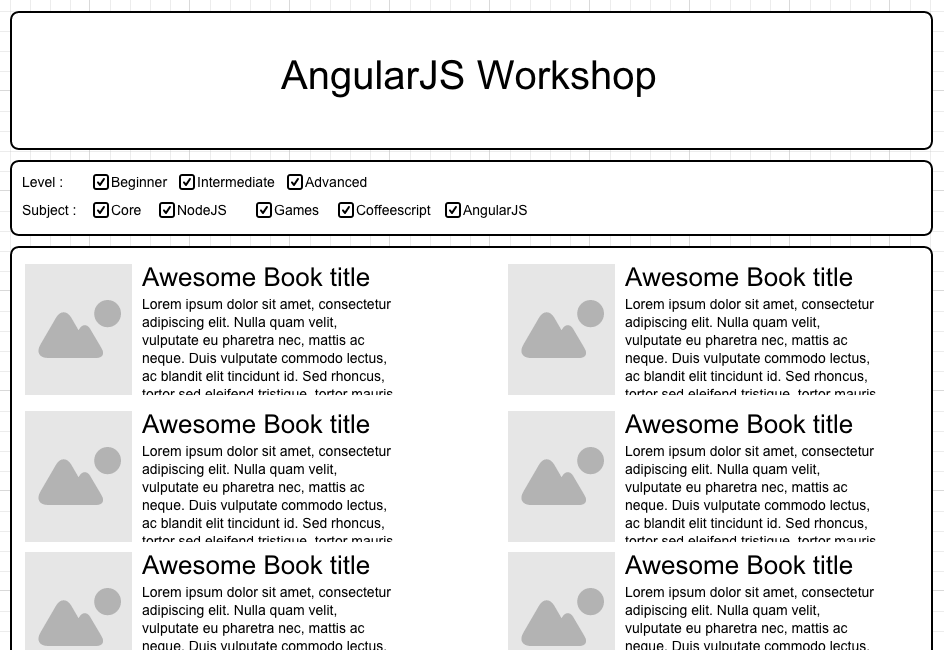

# Simple AngularJS+Bootstrap App

Browser and filter a collection of books.

Demo : https://revolunet.github.io/angularjs-workshop

Raw AngularJS and Bootstrap, from scratch. No tooling, no overhead.

Just follow the commits history : https://github.com/revolunet/angularjs-workshop/commits/master



```sh
git clone https://github.com/revolunet/angularjs-workshop.git
cd angularjs-workshop
npm install -g http-server
http-server
```

# Todo

 - add language flags
 - add testing example
